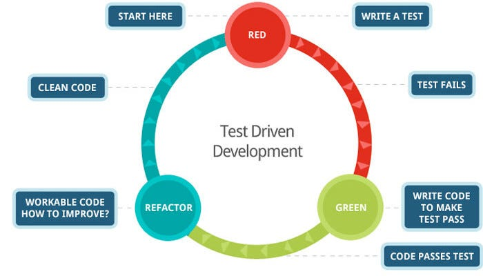

# Entrainement au Test Driven Development

[](https://github.com/gabbloquet/entrainement-au-tdd/actions/workflows/tests.yml)

Oui c'est en Français ! (Et c'est voulu :D)  
Ce repository a pour but de s'exercer au test driven development à travers des exemples (katas), qui, je l'espère, sauront vous divertir.   

## Comment ?

Pour vous entrainer, rien de plus simple !

Tout se passe sur la branche [`exercices`](https://github.com/gabbloquet/entrainement-au-tdd/tree/exercices) : les énoncés y sont tous, mais les classes et les tests se sont volatilisés 🪄  
Plus rien à supprimer à la main, la page est blanche — et c'est exactement ce qu'il faut pour démarrer un kata.

```bash
git clone git@github.com:gabbloquet/entrainement-au-tdd.git
cd entrainement-au-tdd
git switch exercices
```

1. Cliquez sur le lien ci-dessous de l'exercice que vous souhaitez faire.
2. Suivez les instructions ;) (En commençant par développer un test bien entendu :D)
3. Have Fun !

Et le jour où vous voulez comparer votre design avec le mien, mes solutions sont restées sur `master` :

```bash
git diff exercices master -- src/main/java/io/github/gabbloquet/tddtraining/FizzBuzz
```

## Exercices proposés

**Découvrir**
1. [Stack](./src/main/java/io/github/gabbloquet/tddtraining/stack/README.md)

**Facile**
1. [FizzBuzz](./src/main/java/io/github/gabbloquet/tddtraining/FizzBuzz/README.md)
2. [Thermometer](./src/main/java/io/github/gabbloquet/tddtraining/Thermometer/README.md)
3. [PrimeFactors](./src/main/java/io/github/gabbloquet/tddtraining/PrimeFactors/README.md)
4. [LeapYears](./src/main/java/io/github/gabbloquet/tddtraining/LeapYears/README.md)
5. [DictionaryReplacer](./src/main/java/io/github/gabbloquet/tddtraining/DictionaryReplacer/README.md)
6. [EmployeeReport](./src/main/java/io/github/gabbloquet/tddtraining/EmployeeReport/README.md)
7. [Fraction](./src/main/java/io/github/gabbloquet/tddtraining/Fraction/README.md)
8. 🚧 

**Moyen**
1. [Bonjour](./src/main/java/io/github/gabbloquet/tddtraining/Bonjour/README.md)
2. [Wardrobe](./src/main/java/io/github/gabbloquet/tddtraining/Wardrobe/README.md)
3. [ChristmasLight](./src/main/java/io/github/gabbloquet/tddtraining/ChristmasLight/README.md)
4. [Diseur](./src/main/java/io/github/gabbloquet/tddtraining/Diseur/README.md)
5. [BowlingGame](./src/main/java/io/github/gabbloquet/tddtraining/BowlingGame/README.md)
6. [Diamond](./src/main/java/io/github/gabbloquet/tddtraining/Diamond/README.md)
7. [RomanNumerals](./src/main/java/io/github/gabbloquet/tddtraining/RomanNumerals/README.md)
8. [WordWrap](./src/main/java/io/github/gabbloquet/tddtraining/WordWrap/README.md)
9. [Potter](./src/main/java/io/github/gabbloquet/tddtraining/Potter/README.md)
10. 🚧 

**Difficile**
1. [BowlingGameHardcore](./src/main/java/io/github/gabbloquet/tddtraining/BowlingGameHardcore/README.md)
2. [StringCalculator](./src/main/java/io/github/gabbloquet/tddtraining/StringCalculator/README.md)
3. [Tennis Game](./src/main/java/io/github/gabbloquet/tddtraining/TennisGame/README.md)
4. 🚧 

## Qu'est-ce que le Test driven Development ?

Le test driven development est l'une des pratiques mise en avant par la méthode agile **Extreme programming**.
Elle est vivement recommandée par les artisans développeurs (software crafters, cf. Software Craftsmanship).

Elle est certainement la méthode de design de code la plus efficace connue actuellement !  
Cependant, malgré son incroyable efficience, elle est souvent mal comprise.



1️⃣ On commence par RED. Dans cette phase, on va écrire un test qui ne passe pas (s’il ne compile pas, il ne passe pas). À ce moment, on ne se concentre que sur l'intention que l'on veut donner à cette méthode, la logique métier.

2️⃣ Vient ensuite la phase GREEN, ici on va écrire le code le plus simple possible pour faire passer notre test (sans casser un test précédent).

3️⃣ On termine le cycle avec le REFACTORING, où on va retravailler notre code pour :

 - Avoir un code plus élégant, plus lisible ;
 - Améliorer le design ;
 - Expliciter au mieux les traitements qui y sont faits ;
 - Supprimer les duplications...

➡️ On répète ce cycle toutes les quelques secondes voire minutes. Il n'est absolument pas question ici de cycle sur plusieurs jours. On fait plusieurs centaines de cycles de TDD dans une journée !

### Comment ?
Il peut être décrit succinctement par l'ensemble des règles suivantes :

1. Ecrire un "seul" test décrivant un comportement
2. Exécuter le test, qui doit échouer parce que le programme n'a pas cette fonctionnalité
3. écrire "juste assez" de code, le plus simple possible, pour faire passer le test
4. "remanier" le code jusqu'à ce qu'il soit qualitatif
4. répéter, en "accumulant" les tests et donc les règles du comportement attendu.

### Avantages
 - Meilleure architecture du programme et meilleure qualité du code (petites fonctions, principes DRY)
 - réductions significatives des taux de défauts
 - Augmente la compréhension du code (documentation détaillée du projet)
 - permet de mettre en évidence les cas à la marge
 - réduit le temps nécessaire au développement du projet (feedback rapide, moins de bugs ou d'erreurs)

### Tips

#### Se focaliser d'abord sur les cas simples

D'abord se focaliser sur les cas simples.
Par exemple dans le cas de [FizzBuzz](./src/main/java/io/github/gabbloquet/tddtraining/FizzBuzz/README.md), nous commençons par les chiffres non compris dans les règles à implémenter => 1 & 2.

#### Comportement / Behavior

Un test doit décrire un comportement. L'objectif de la suite de tests est de mettre en avant tout ce qui défini ce que l'on veut développer.  
Ces tests prouvent que le code écrit fonctionne.

#### Écrire le code MINIMAL

On ne fait pas ce que les tests ne nous ont pas demandé de faire ! L'objectif est de faire passer le test au plus vite, on va droit au but pour faire passer le test que nous venons d'écrire.
Ensuite, nous pouvons refactor.

#### Isolation

Un test doit être unitaire, ne pas être connecté de manière quelconque à un autre test.   
Exemple : Si on écrit quelque chose en base de données, il ne faut pas qu'un autre test fail du fait qu'un élément a été ajouté auparavant.

Attention cela ne signifie pas que l'on ne test qu'une seule fonction avec un test, on test bien un comportement !

#### La triangulation

Après avoir implémenté une règle métier / un test (avec Red-Green-Refactor), assurez-vous de trouver toutes les "bizarreries" ou non-généralités dans le code de production et éliminez-les une par une en écrivant un test qui prouve cette non-généralité.
Assurez-vous de tester les cas à la marge !

#### Pause ? Laisser un test qui ne passe pas

Si vous souhaitez faire une pause, reprendre le kata plus tard, je vous conseille de laisser un test qui ne passe pas.  
Celui-ci vous permettra de retrouver facilement où vous en étiez.

#### Le papier

Personnellement, j'aime le support papier et m'en sers quotidiennement. Pour ce qui est de la réalisation des katas je ne peux que conseiller de s'en servir. Cela peut parfois s'avérer très utile pour garder en tête les règles clés, dessiner des choses (Cf. Kata Christmas Light), noter pour se souvenir / ne pas oublier...

### Quelques ressources

 - [Wikipedia](https://fr.wikipedia.org/wiki/Test_driven_development)
 - [OpenClassroom](https://openclassrooms.com/fr/courses/3504461-testez-linterface-de-votre-site/4270571-apprenez-le-test-driven-development-tdd)
 - [Apprendre le TDD par IPPON](https://blog.ippon.fr/2020/02/12/apprendre-le-tdd/)
 - [Vidéo : Comment faire du TDD](https://www.youtube.com/watch?v=wbZ6jWmRY14)
 - [Video : TDD par l'exemple](https://www.youtube.com/watch?v=nbSaq_ykOl4)
